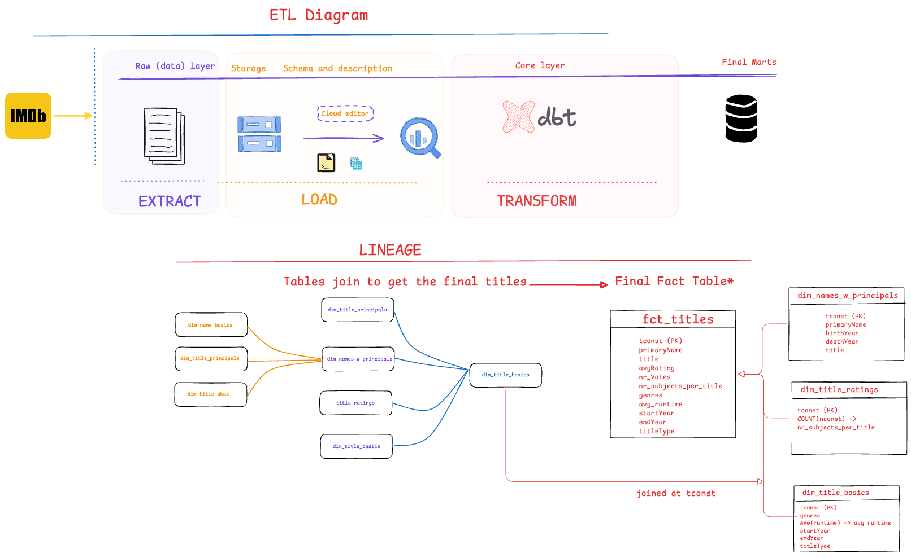

# ABOUT THIS PROJECT

This project focuses on taking a series of steps from getting the data into raw format and creating a data mart, after doing the necessary transformations, that will be used in further analysis/ visualizations.

# DATA SOURCES

The original files in .tsv format aren't uploaded to this repository, due to its large size.

## Raw data

Data downloaded by the imdb data that are saved in a delimited format. 
https://developer.imdb.com/non-commercial-datasets/

While ingesting the raw data it was noticed: 
- Their size was very big, and they were splitted into data chunks.
- Data formatting issues that caused a lot of errors when trying to load into the gcs bucket.

## Ingested data

Folder with the final outcome after removing bad characters and breaking the data files into chunks.

# DATA MODEL

## Staging tables

The data tables created in staging describe:
- dim_name_basics: artists' names with title codes and info around their birth and/ or death year.
- dim_names_w_principals: used to get the title of each movie, tv show, etc. and joined with the other tables. 
- dim_title_akas: used as an intermediate to join with other tables to get the titles.
- dim_title_basics: contains information on the duration, genres of the different titles.
- dim_title_ratings: ratings from the website users, and the number of votes.

## Core layer

Created after joining the tables in the staging layer on the selected dimensions (see diagram) and aggregating on various related metrics to be used in visualizations and analysis.

